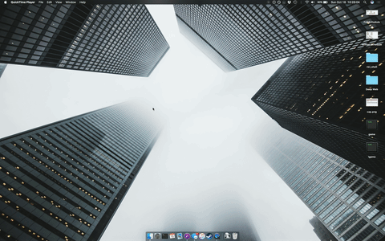

# hide
quickly &amp; easily hide/show the contents of a directory

## Demo
<p align="center">
  
</p>

## Installation
## [Homebrew approval pending](https://github.com/Homebrew/homebrew-core/pull/10043)

### [Download](https://github.com/EvanCooper9/hide/archive/master.zip)
```
wget https://github.com/EvanCooper9/hide/archive/master.zip
```

### PATH
 * Place in desired directory
 * Add to your .bash_profile : `PATH=$PATH:/full/path/to/hide`

### Setup
```
hide
> Thank you for installing hide!
> Would you like to enable Auto hide (y/n)? y
> What directory would you like to hide ~/Desktop
```

## Usage
```
hide [-s] | [-h] | [-d DEST] | [-D] | [-a] | [-A] | [-i] | [-r]
```

### Options
  * `-s` Show the files of the current profile
  * `-h` Hide the files of the current profile
  * `-d  DEST` Change the current destination. Where `DEST` is the destination to hide
  * `-D` Show the current destination
  * `-a` Enable/disable Auto hide: show/hide based on the current state
  * `-A` Show if auto hide is enabled/disabled
  * `-i` Show hide info page (Only really useful when Auto hide is enabled)
  * `-r` Restore hide to defaults

## Features
### Auto hide
Auto hide eliminates the need for the `-s` and `-h` flags. It will automatically hide/show the files from the current destination based on the current state. Simple type `hide` and the rest will be taken care of.
